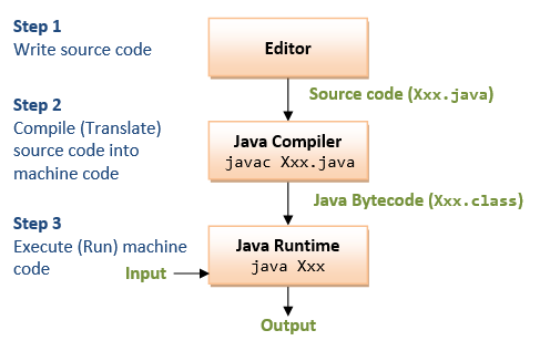

# Learning Java 8

## Table of contents

- [Java Compiler](#1)
- [Comentários](#2)
- [Tipos Primitivos](#3)
- [Operadores](#4)
- [Operador Ternario](#5)
- [Arrays](#6)
- [Function VS Methods](#7)
- [Sobrecarga](#8)
- [Construtores](#9)

##
<a name="1">
<h1>Java Compiler</h1>
</a>
O processo de compilação Java transforma o código-fonte em bytecode, 
um formato intermediário que a Máquina Virtual Java (JVM) pode ler e executar. 
Essa arquitetura permite a portabilidade do Java em vários sistemas operacionais.



<a name="2">
<h1>Comentários</h1>
</a>
Os métodos públicos na sua classe devem ter um comentário javadoc
<br/>

```
/**
* Comentário javadoc
* /
```

<a name="3">
<h1>Tipos Primitivos</h1>
</a>
Em Java não existe o tipo primitivo "string", String é um objeto.

```
public class TiposPrimitivos {
    public static void main(String[] args){
        //int, double, float, boolean,char, byte, short, long
        int age = 18;
        long bigNumber = 10000;
        float salaryFloat = 2500;
        double salaryDouble = 2500;
        boolean trueValue = true;
        boolean falseValue = false;
        short ageShort = 29;
        byte ageByte = -128;
        char character = '\u0041'; //unicode
        String name = "Raissa";
    }
}
```

<a name="4">
<h1>Operadores</h1>
</a>

```
// + - / *
// %
// < > <= >= != ==
// && (AND) || (OR) ! (NOT)
// = += -= *= /= %=
        double bonus = 1800;
        bonus += 1000; // bonus = bonus + 1000
        bonus -= 1000; // bonus = bonus - 1000
        bonus *= 2; // bonus = bonus * 2
        bonus /= 2; // bonus = bonus / 2
        bonus %= 2; // bonus = bonus % 2
        System.out.println(bonus);

        // Unary ++ --
        int count = 0;
        count ++; // ++count;
        count --;
        System.out.println(count);
```

<a name="5">
<h1>Operador Ternario</h1>
</a>

```
  // if salary > 2000 "buy laptop" "don't buy laptop"
        double salary = 35880;
        String shouldBuyMessage = "buy laptop";
        String shouldNotBuyMessage = "don't buy laptop";
        // (condition) ? <true> : <false>
        String displayMessage = salary > 2000 ? shouldBuyMessage : shouldNotBuyMessage;

        System.out.println(displayMessage);
```

<a name="6">
<h1>Arrays</h1>
</a>

- Arrays são consideradas um objeto na memória.
- Você não pode acessar uma posição inexistente.


- Output padrão de cada tipo quando não inicializado.
```
//Initial default when not initialized
        //byte, short, int, long, float e double = 0
        // char '\u0000'
        //boolean = false
        // String = null
```

- Array multidimensional

```
    public static void main(String[] args) {
        //1,2,3,4,5 months
        //31,28,31,30 days
        int[][] days = new int[3][3];
        days[0][0] = 31;
        days[0][1] = 28;
        days[0][2] = 31;

        days[1][0] = 30;
        days[1][1] = 31;
        days[1][2] = 30;

        for (int i = 0; i < days.length; i++) {
            for (int j = 0; j < days[i].length; j++) {
                System.out.println(days[i][j]);
            }
        }
```


<a name="7">
<h1>Função VS Métodos</h1>
</a>

- Funções: Blocos de código reutilizáveis que realizam tarefas.
- Métodos: Funções associadas a classes que operam sobre os dados de objetos.


<a name="8">
<h1>Sobrecarga de método</h1>
</a>
É você ter o dois métodos com o mesmo nome, porém o tipo ou a 
quantidade dos parâmetros são diferentes.

```
public void init(String name, String type, int episodes){
        this.name = name;
        this.type = type;
        this.episodes = episodes;
    }

    public void init(String name, String type, int episodes, String gender){
        this.init(name, type, episodes);
        this.gender = gender;
    }
```

<a name="9">
<h1>Construtores</h1>
</a>

- É executado antes de qualquer método que tenha na classe.
- Para chamar outro construtor, o this precisa ser a primeira linha.

```
  public Anime(String name, String type, int episodes, String gender){
        this();
        this.name = name;
        this.type = type;
        this.episodes = episodes;
        this.gender = gender;
    }

    public Anime(String name, String type, int episodes, String gender, String estudio){
        this(name, type, episodes, gender);
        this.estudio = estudio;
    }
```